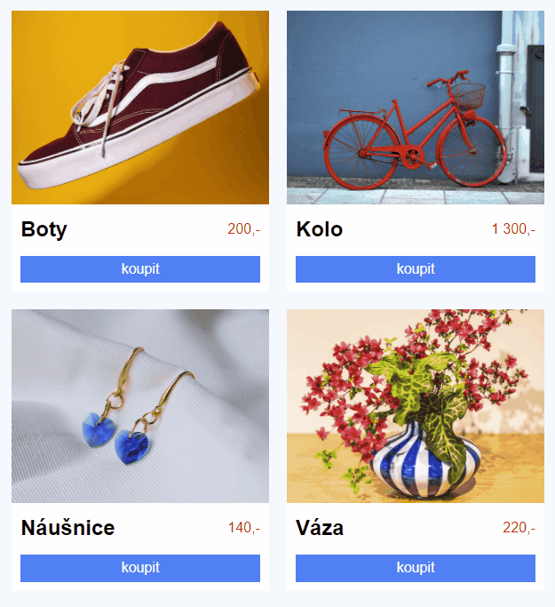

# Cvičení: SASS převody

- Naklonuj si tento repozitář a kopii stáhni k sobě do počítače.

- Ve složce repozitáře nainstaluj potřebné závislosti spuštěním příkazu `npm install` na příkazové řádce.

- Uprav `styly.scss` podle CSS předlohy na konci zadání.

  - Ve stylech jsou tři komponenty `.vypis`, `.produkt` a `.tlacitko`. Využij zanořování v SASSu tak, aby se každý ze tří názvů objevil v `styly.scss` jen jednou.

  - Pro barvu pozadí tlačítka použij SASS proměnnou. Jako hodnotu nastav `#0b7ff4` a na `:hover` a `:focus` tuto barvu zatmav pomocí funkce `darken($hlavni-barva, 20%)`.

  - Průběžně kontroluj, že tvé styly fungují, jsou sestavitelné pomocí příkazu `npm run build`.

  - Výsledek by v prohlížeči měl vypadat takto:

    

## Předloha výsledných stylů

```css
html {
	box-sizing: border-box;
}

*,
*::before,
*::after {
	box-sizing: inherit;
}

body {
	font-family: sans-serif;
	background-color: #f3f9ff;
	max-width: 600px;
	margin: 20px auto;
}

.vypis {
	display: grid;
	grid-template-columns: repeat(auto-fill, minmax(200px, 1fr));
	gap: 20px;
}

.produkt {
	background-color: #ffffff;
}
.produkt__media {
	width: 100%;
	aspect-ratio: 4/3;
	object-fit: cover;
}
.produkt__media--bota {
	object-position: 50% 30%;
}
.produkt__media--kolo {
	object-position: 50% 100%;
}
.produkt__media--nausnice {
	object-position: 50% 50%;
}
.produkt__media--vaza {
	object-position: 50% 68%;
}
.produkt__obsah {
	padding: 10px;
	display: grid;
	grid-template-columns: 1fr auto;
	align-items: center;
}
.produkt__nazev {
	margin: 0;
}
.produkt__cena {
	color: #f00000;
}
.produkt__akce {
	margin-top: 16px;
	grid-column: 1/-1;
	text-align: center;
	display: flex;
}

.tlacitko {
	display: inline-block;
	color: #ffffff;
	background-color: #0b7ff4;
	padding: 0.4em 0.8em;
	text-decoration: none;
	flex-grow: 1;
}
.tlacitko:hover,
.tlacitko:focus {
	background-color: #074c92;
}
```

## Bonus

- Na obrazovkách větších než `600px` zvětši velikost textu v tlačítku na `20px`.

- Přepiš `scss` na `sass`. Budeš muset změnit příponu v názvu souboru a výskyty v `package.json`, taky odstranit všechny přebytečné závorky a středníky.
